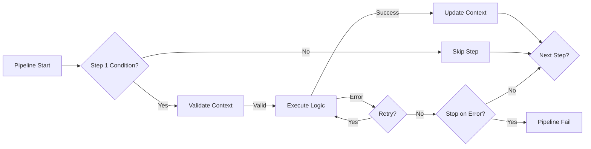

# PipelineFramework

**Version:** 1.0.0  
**Layer:** Application Orchestration (Layer 3)  
**Dependencies:** CoreUtilsLib, GasResilienceLib (Optional)

## 🏗️ File and Folder Structure

Organized into core framework components and specialized step patterns:

```text
PipelineFramework/
├── src/
│   ├── Pipeline.js             # The main orchestrator (Engine)
│   ├── PipelineContext.js      # Shared state container with metadata and history
│   ├── Step.js                 # Base class for all pipeline tasks
│   ├── ProducerStep.js         # Domain-decision step (Decoupled logic)
│   ├── ConsumerStep.js         # Infrastructure-action step (Decoupled execution)
│   ├── PostProcessableStep.js  # Decorator for steps with post-processing needs
│   ├── postprocessor/          # Post-processing engine for step results
│   │   ├── PostProcessorChain.js # Sequence of transformations
│   │   ├── PostProcessorRegistry.js # Centralized library of processors
│   │   └── builtin/            # Common processors (Mapping, Formatting, etc.)
│   ├── errors/                 # Framework exceptions (Validation, Execution)
│   └── __tests__/              # Pipeline unit and integration tests
```

## 🧩 Programming Patterns

1.  **Chain of Responsibility Pattern**: The foundational pattern. Each step is a link in a chain that processes data and decides whether to pass it to the next step.
2.  **Template Method Pattern**: The `Step` base class defines the invariant execution logic (hooks, logging, validation) while leaving the specific task implementation to subclasses via the `_executeLogic` method.
3.  **Command Pattern**: Each `Step` is a command object that encapsulates everything needed to perform a task at a later time.
4.  **Observer Pattern**: The pipeline uses lifecycle hooks (`beforeStep`, `afterStep`, `onError`, `onComplete`) to allow external logic to observe and react to its execution.
5.  **Decorator Pattern**: `PostProcessableStep` wraps standard steps to add post-processing capabilities without changing their core logic.
6.  **Producer-Consumer Pattern**: A specialized architectural pattern for strictly decoupling business decisions (Producers) from infrastructure actions (Consumers).

## ⛓️ Overview

**PipelineFramework** is a lightweight, domain-agnostic engine for orchestrating sequential workflows in Google Apps Script. It implements the **Chain of Responsibility** pattern, allowing developers to break complex processes into small, reusable, and testable units called **Steps**.

Unlike a simple function chain, this framework provides a robust runtime environment with a shared **Context**, lifecycle hooks, execution history tracking, and optional integration with `GasResilienceLib` for automatic error recovery.

## ✨ Key Features

- **Sequential Execution**: Executes steps in a defined order, passing a mutable `PipelineContext` between them.
- **Shared State Management**: A robust `PipelineContext` object allows steps to read inputs and write outputs safely, with built-in metadata tracking.
- **Lifecycle Hooks**: Inject logic at specific points: `beforeStep`, `afterStep`, `onError`, and `onComplete`.
- **Conditional Execution**: Steps can decide whether to run or skip based on the current context state (`shouldExecute`).
- **Graceful Termination**: Steps can request the pipeline to stop early (`context.requestStop()`) without throwing errors.
- **Resilience Integration**: If `ExceptionService` is provided, steps automatically retry upon failure according to the configured strategy.
- **Dry-Run Mode**: Preview pipeline execution without running steps.

## 🧪 Dry-Run Mode

Pipeline supports dry-run mode for testing and previewing execution flow without actually running steps.

### Enabling Dry-Run Mode

**Constructor-Level:**

```javascript
const pipeline = new Pipeline(logger, exceptionService, {
  name: 'DataPipeline',
  dryRun: true // All executions will be simulated
});

pipeline
  .addStep(new FetchDataStep(logger))
  .addStep(new ProcessDataStep(logger))
  .addStep(new SaveDataStep(logger));

const result = pipeline.execute({ sourceId: '123' });
// Logs which steps would execute but doesn't run them
// Result context contains: { dryRun: true, simulatedSteps: ['FetchData', 'ProcessData', 'SaveData'] }
```

**Per-Execution Override:**

```javascript
const pipeline = new Pipeline(logger);

pipeline.addStep(new FetchDataStep(logger)).addStep(new ProcessDataStep(logger));

// Dry-run this execution
const result = pipeline.execute({ sourceId: '123' }, { dryRun: true });
// Returns context with simulated execution

// Later, run for real
const realResult = pipeline.execute({ sourceId: '123' });
```

### Dry-Run Response

```javascript
const result = pipeline.execute({ data: 'test' }, { dryRun: true });
// Context contains:
// {
//   dryRun: true,
//   simulatedSteps: ['FetchData', 'ProcessData', 'SaveData']
// }
```

## 📦 Installation

```javascript
import { Pipeline, Step, PipelineContext } from '@PipelineFramework';
import { LoggerService } from '@CoreUtilsLib';
```

## 🚀 Quick Start

### 1. Create a Custom Step

Extend the `Step` class and implement `_executeLogic`.

```javascript
class FetchDataStep extends Step {
  constructor(logger) {
    super('FetchData', logger, {
      requiredKeys: ['sourceId'] // Auto-validates context before running
    });
  }

  _executeLogic(context) {
    const id = context.get('sourceId');
    // Perform logic...
    const data = { id, value: 100 };

    this.logger.info('Data fetched successfully');

    // Write result to context for next steps
    this.setResult(context, 'rawData', data);
  }
}
```

### 2. Build and Run Pipeline

```javascript
const logger = new LoggerService();
const pipeline = new Pipeline(logger);

pipeline
  .addStep(new FetchDataStep(logger))
  .addStep(new ProcessDataStep(logger))
  .addStep(new SaveDataStep(logger))
  .onComplete((context, success) => {
    console.log(`Pipeline finished. Success: ${success}`);
  });

// Execute with initial data
const finalContext = pipeline.execute({ sourceId: '12345' });
```

## 📚 API Reference

### 1. Pipeline

The orchestrator class.

- **`addStep(step)`**: Adds a step to the sequence.
- **`execute(initialData)`**: Starts the pipeline. Returns the final `PipelineContext`.
- **`clearSteps()`**: Resets the pipeline.
- **Hooks**:
  - `beforeStep((step, ctx) => ...)`
  - `afterStep((step, ctx, result) => ...)`
  - `onError((step, ctx, error) => ...)`
  - `onComplete((ctx, success) => ...)`

### 2. Step (Abstract)

Base class for all tasks.

- **`_executeLogic(context)`**: **[Abstract]** The core logic. Must be implemented by subclasses.
- **`shouldExecute(context)`**: Override to add conditional logic (returns `true`/`false`).
- **`setResult(context, key, value)`**: Helper to write to context and log the action.
- **`verifyContext(context)`**: Manually trigger validation of required keys.
- **Options**:
  - `requiredKeys`: Array of keys that must exist in context before execution.
  - `continueOnError`: If `true`, pipeline continues even if this step fails.

### 3. PipelineContext

The state container passed between steps.

- **`get(key, defaultValue)`**: Retrieve data.
- **`set(key, value)`**: Store data.
- **`has(key)`**: Check existence.
- **`requestStop(reason)`**: Signals the pipeline to stop after the current step finishes.
- **`getSummary()`**: Returns execution statistics (duration, steps completed/failed, history).

## 🛡️ Error Handling & Resilience

The framework handles errors at two levels:

1.  **Step Level**: If a step throws an error:
    - It is caught and wrapped in a `StepExecutionError`.
    - If `ExceptionService` was passed to the `Pipeline` constructor, the step is **automatically retried** (default 3 times).
    - If it still fails (or no resilience service is used), the `onError` hook is fired.
    - If `continueOnError` is false (default), the pipeline stops.

2.  **Validation Level**: If `requiredKeys` are missing, a `ContextValidationError` is thrown before `_executeLogic` is called.

## ⚙️ Architecture



## 🔄 Producer-Consumer Pattern

**NEW in v1.0.0**: Strictly decoupled Producer-Consumer step pattern for separating business logic (decision) from infrastructure logic (execution).

### Overview

The Producer-Consumer pattern enforces a strict separation of concerns:

- **ProducerStep** (Decision): Evaluates business rules using `GasExpressionEngineLib` and writes scalar results to context
- **ConsumerStep** (Action): Reads values from context and performs technical operations without knowing the business logic

This pattern ensures that:

- Business logic is centralized in ProducerSteps
- Infrastructure code (ConsumerSteps) is reusable across different business contexts
- The PipelineFramework remains lightweight (ConsumerSteps have zero dependencies on ExpressionEngine)

### ProducerStep

Abstract base class for decision-making steps.

```javascript
import { ProducerStep } from '@PipelineFramework';
import { ExpressionEngineService } from '@GasExpressionEngineLib';

class TemplateSelectorStep extends ProducerStep {
  constructor(logger, expressionEngine) {
    super('TemplateSelector', logger, expressionEngine, {
      outputKey: 'selected_template_id',
      requiredKeys: ['grade', 'absences']
    });
  }

  evaluateRules(context) {
    // Business logic: Evaluate expressions
    if (this.expressionEngine.evaluate('{{grade}} >= 6 && {{absences}} < 5', context.getData())) {
      return 'TEMPLATE_PASS';
    }
    if (this.expressionEngine.evaluate('{{grade}} < 6', context.getData())) {
      return 'TEMPLATE_FAIL';
    }
    return 'TEMPLATE_DEFAULT';
  }
}
```

**Key Features:**

- Depends on `GasExpressionEngineLib` for expression evaluation
- Must return a scalar value (string/number/boolean)
- Writes result to configured `outputKey` in context
- Performs NO external actions (no API calls, no file operations)

### ConsumerStep

Abstract base class for action-performing steps.

```javascript
import { ConsumerStep } from '@PipelineFramework';

class GenerateDocumentStep extends ConsumerStep {
  constructor(logger, driveService) {
    super('GenerateDocument', logger, {
      inputKey: 'selected_template_id',
      outputKey: 'generated_document',
      requiredKeys: ['selected_template_id', 'student_name']
    });
    this.driveService = driveService;
  }

  performAction(templateId, context) {
    // Infrastructure logic: Create document
    // Does NOT know WHY this templateId was chosen
    const studentName = context.get('student_name');
    const doc = this.driveService.createDocumentFromTemplate(templateId);

    return {
      id: doc.getId(),
      url: doc.getUrl(),
      name: `${studentName} - Report`
    };
  }
}
```

**Key Features:**

- **Zero dependencies** on `GasExpressionEngineLib`
- Reads input value from configured `inputKey`
- Performs technical operations (API calls, file creation, etc.)
- Optionally writes result to `outputKey`
- Agnostic to business logic

### Complete Example

```javascript
import { Pipeline, ProducerStep, ConsumerStep } from '@PipelineFramework';
import { ExpressionEngineService } from '@GasExpressionEngineLib';
import { LoggerService } from '@CoreUtilsLib';

// Setup
const logger = new LoggerService();
const expressionEngine = new ExpressionEngineService({ logger });
const driveService = new DriveService({ logger });

// Create pipeline with Producer → Consumer
const pipeline = new Pipeline(logger);

pipeline
  .addStep(new TemplateSelectorStep(logger, expressionEngine))
  .addStep(new GenerateDocumentStep(logger, driveService));

// Execute
const result = pipeline.execute({
  grade: 8,
  absences: 2,
  student_name: 'John Doe'
});

// Result:
// - selected_template_id: 'TEMPLATE_PASS' (from Producer)
// - generated_document: { id: '...', url: '...', name: '...' } (from Consumer)
```

### Benefits

1. **Separation of Concerns**: Business logic (ProducerStep) is completely separate from infrastructure (ConsumerStep)
2. **Reusability**: ConsumerSteps can be reused with different ProducerSteps
3. **Testability**: Producer and Consumer can be tested independently
4. **Maintainability**: Changing business rules doesn't require changing infrastructure code
5. **Lightweight Framework**: Projects without ExpressionEngine can still use ConsumerSteps

## 🧪 Testing

Steps can be tested in isolation by mocking the `PipelineContext`.

### Unit Tests

```bash
npm test PipelineFramework
```

### Integration Tests

```bash
npm run test:integration
```

### Online Tests

The `__testOnline__` directory contains real-world tests that run in Google Apps Script environment, including Producer-Consumer pattern tests with actual Drive file creation.
